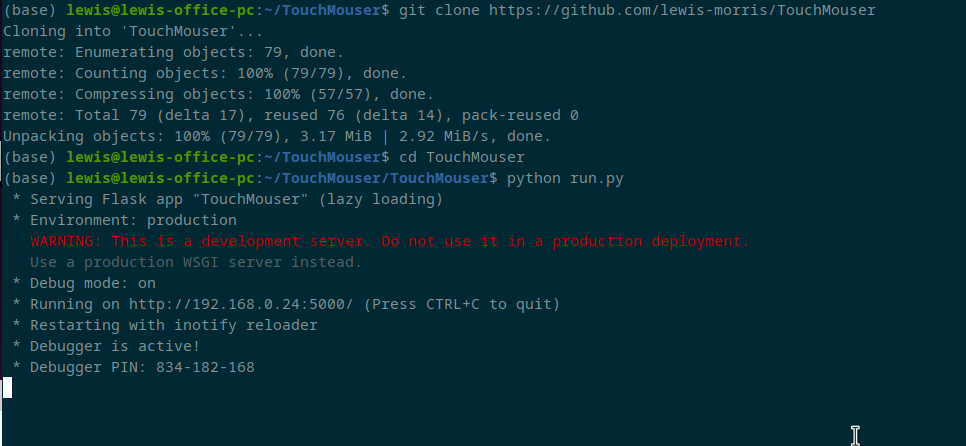
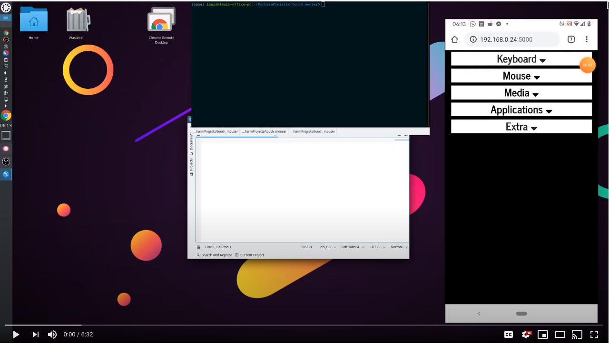

TouchMouser - Python/ Javascript Remote Control
---------------------------------- 

Simple remote computer controller (for mobile) - powered by Python/Flask/RESTful API's and Javascript/AJAX.

> DISCLAMER - Please beware this has not been tested for security and if you run on an insecure network it is possible you will open your self up to attack. 

> MADE FOR LINUX - Its working on my linux machine but its just a proof of concept and may not work out the box for you.

### Install  

On the host PC 

```commandline
    git clone https://github.com/lewis-morris/TouchMouser
    cd TouchMouser
    python run.py
```




To Control the computer, open a browser directed to the ip address of the computer port 5000

i.e 

http://192.168.0.1:5000 

### Usage

Swipe anywhere to move the mouse.

Open the mouse options to click

- If the sensitivity of the mouse is not enough please go to the "EXTRA" section and try increasing the "mouse speed multiplier" or lowering the "Time between mouse send (ms)"

To type - open the keyboard options and send keys presses in blocks.

You can also send multimedia keys such as skip track and sleep


### Working Example

[](https://www.youtube.com/watch?v=Iy_0_O2fb9k)

